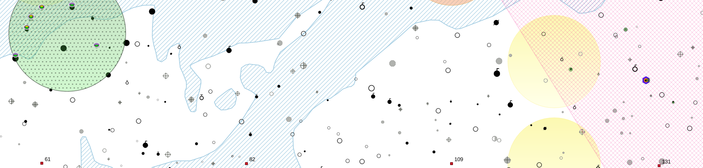
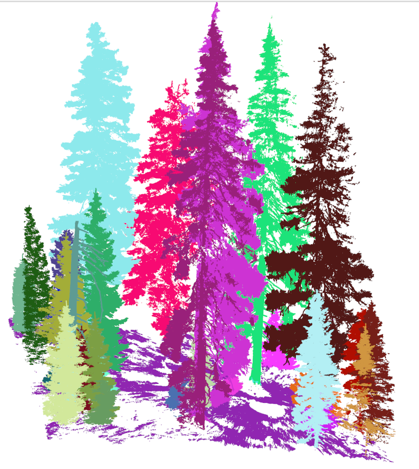

some introduction here ...  

Table of contents  
 1. [TREES](#trees)
 2. [SOILS](#soils)
 3. [REMOTE SESNISNG](#remotesensing)
 4. [...](#...)

*******

  

## TREES

description of data here

> layer 1  
> layer 2  
> ...  

  

## SOILS

description of data here

> layer 1  
> layer 2  
> ...   

  

## REMOTE SENSING

description of data here

> layer 1  
> layer 2  
> ...   

